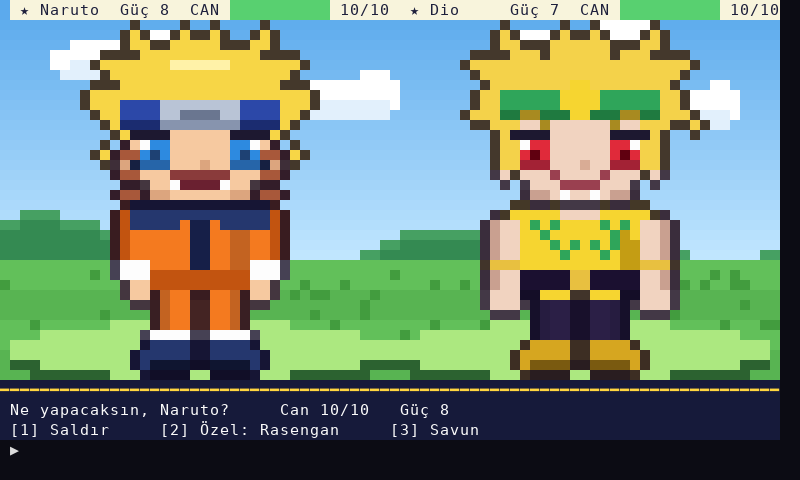
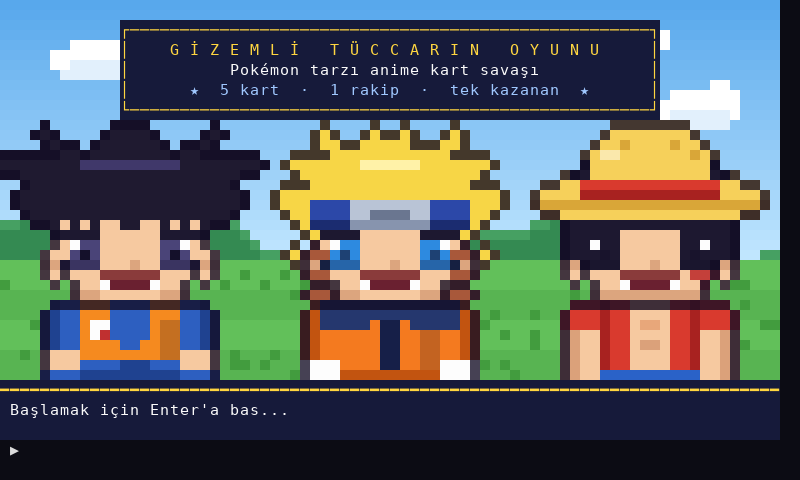
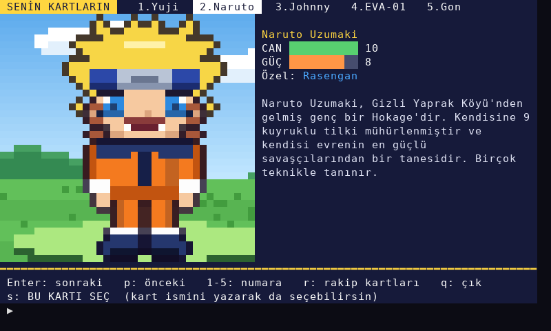
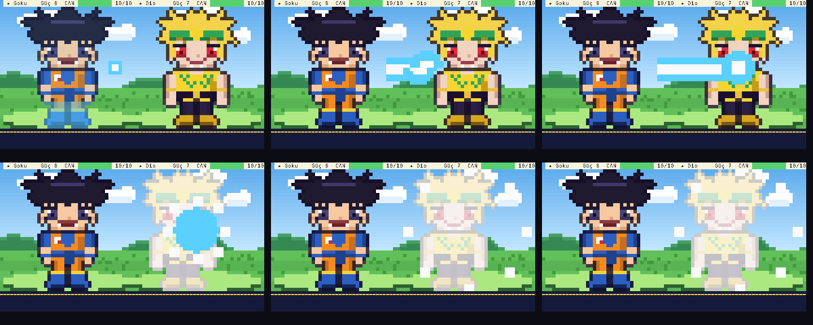
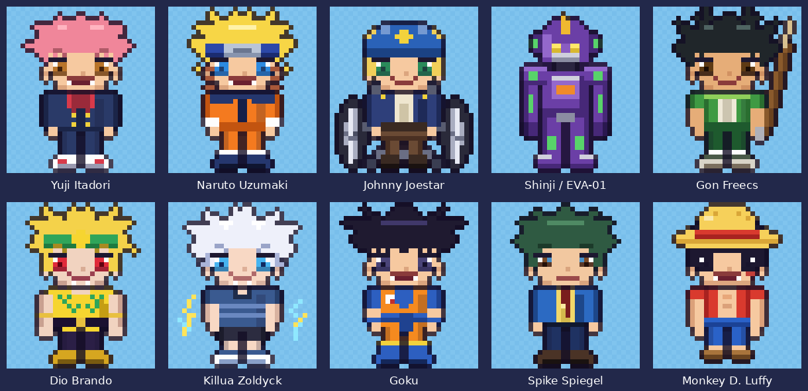

# Gizemli Tüccarın Oyunu

Pokémon tarzı, **piksel sanatlı anime kart savaşı**. Terminalde çalışır, ek kütüphane gerekmez.



## Çalıştırma

```
python gizemli_tuccar.py
```

* `gizemli_tuccar.py` ile `sprites.py` **aynı klasörde** olmalı.
* Python 3.7+ yeterli. Terminal en az **80x24** olmalı (daha küçükse oyun uyarır).
* Renkli piksel sanat için normal bir terminal kullan: Windows Terminal / PowerShell / cmd,
  macOS Terminal, VS Code terminali, Linux terminali. (256 renk ya da truecolor otomatik seçilir.)
* IDLE / Thonny gibi renk desteği olmayan ortamlarda oyun **renksiz moda** geçer: sprite'lar ASCII olarak çizilir.
* `GT_RENK=256` (veya `true` / `yok`) ile renk modunu elle seçebilirsin.

## Nasıl oynanır?

1. **Kart seç.** Enter ile kartlar arasında gez, `1-5` ile numaraya atla, `r` ile rakibin kartlarına bak,
   `s` ile seç. Kart ismini yazarak da seçebilirsin (`naruto`, `gon`, ...).
2. Gizemli Tüccar rakibin kartını silüetle çeker.
3. **Savaş** (sıra tabanlı, sen önce başlarsın):
   * `1` **Saldır** – hasar = Güç (%12,5 ihtimalle kritik: x1,5).
   * `2` **Özel hamle** – savaşta bir kez; hasar = Güç x 2, ama %75 isabet. (HUD'da `★` = hazır)
   * `3` **Savun** – bu tur gelen hasar yarıya iner ve 1 Can yenilenir. (HUD'da `◈`)
4. Rakibin Canı 0'a inerse kazanırsın. İstediğin kadar tekrar oynayabilirsin.

| Önizleme | |
|---|---|
|  |  |
|  |  |

## Orijinal koddaki hatalar ve düzeltmeleri

| Hata | Düzeltme |
|---|---|
| `Gon` kartında anahtarlar `'Sağlık'/'Güç'`, diğerlerinde `'Saglik'/'Guc'` → Gon seçilirse `KeyError` | Tüm kartlarda aynı anahtarlar |
| Kart seçimi sadece **bilgisayarın** kartlarını (Dio, Killua, Goku) kontrol ediyordu ve `Dio_Brando in cards` hiç doğru olamazdı → `card` yazı (`str`) kalıyor, `card['Guc']` satırında `TypeError` | Oyuncu kendi 5 kartından seçer; isim ya da numara kabul edilir, yanlış girişte uyarı verilir |
| `print('' * 10, ...)` boş yazıyı 10 kez yazıyordu (emoji/süs karakteri kaybolmuş) | Başlık ekranı |
| Savaş, kartların `Saglik` değerini kalıcı olarak düşürüyordu | Savaş, her kart için ayrı bir `Savasci` kopyasıyla yapılır; tekrar oynanabilir |
| Tek, otomatik bir saldırı döngüsü; oyuncu hiçbir şey seçemiyordu | Saldır / Özel hamle / Savun menüsü |
| Karakter hikâyeleri oyun başlamadan hepsi birden yazdırılıyordu, bazı yazımlar bozuktu (`Saglik`, `bakalim ... durdurabilecekmi`) | Kart ekranında okunur; Türkçe karakterler düzeltildi, Yuji'deki tekrar eden cümle sadeleştirildi |

Kart değerleri (Sağlık / Güç) orijinaldeki gibidir.

## Karakterleri düzenlemek

Sprite'lar `sprites.py` içinde düz metin olarak durur (her biri **32x36 piksel**).
`palet` harflerin renklerini, `satirlar` pikselleri tutar; `.` saydamdır. Bir harfi değiştirip oyunu
yeniden çalıştırman yeterli. Yeni bir kart eklemek için `gizemli_tuccar.py` içindeki `kart(...)` satırlarına bak.

## Testler

```
python -m unittest -v
```
